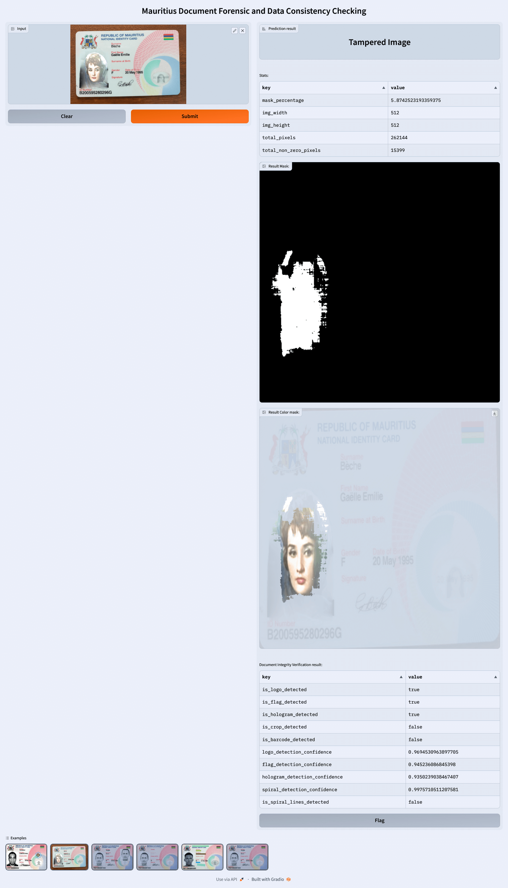
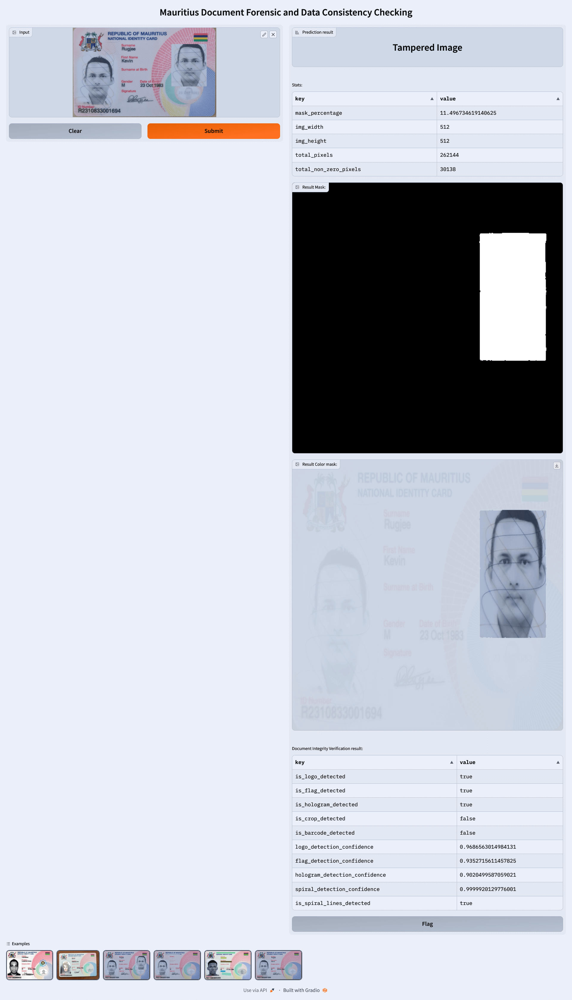
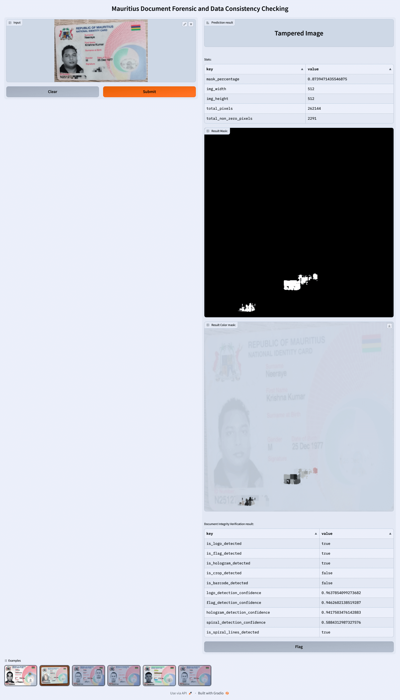
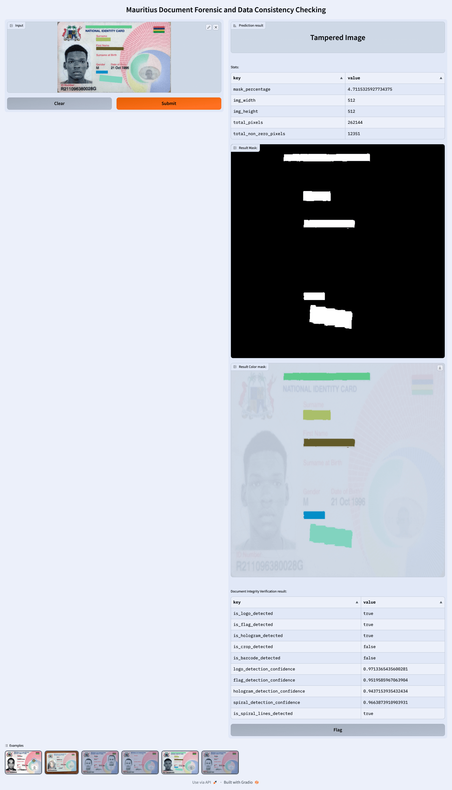
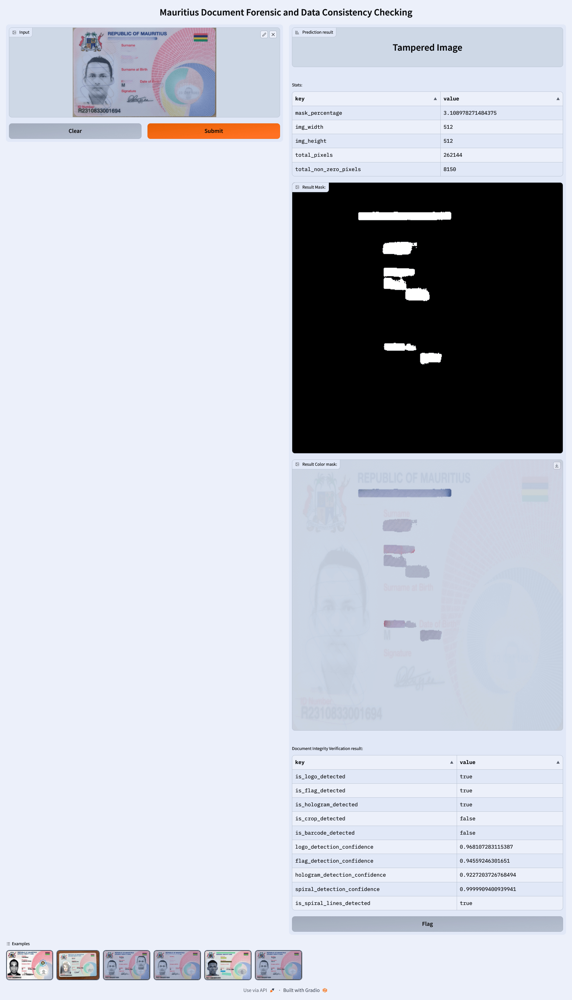

# Forensic Features

The Document Forensic Project is equipped with several forensic features designed to detect and analyze digital manipulations within documents. Each feature focuses on a particular type of forgery, providing a detailed analysis to help verify the authenticity of digital documents.

- [Forensic Features](#forensic-features)
    - [Splicing Detection](#splicing-detection)
    - [Copy-Move Detection](#copy-move-detection)
    - [Erasing Detection](#erasing-detection)
    - [Masking Detection](#masking-detection)
    - [Inpainting Detection](#inpainting-detection)

### Splicing Detection

Image splicing (or Compositing) involves cutting a portion of one image and pasting it onto another. In the context of document forgery, it's taking a part of one official document and merging it with another to create a deceptive document.

- **Example 1**: Combining the photo from a stolen passport with the details page of a different, valid passport.
- **Example 2**: Merging the signature from one driving license onto another to make the latter appear genuine.

- **Example 3**: Combining Two Passports:
    - **Scenario**: A person has an expired passport with a valid visa and a new passport without that visa. They want to use the valid visa from the expired passport while traveling with their new passport.
    - **Splicing Action**: The forger cuts out the visa page or stamp from the expired passport and pastes it onto a page in the new passport. It's made to look seamless, as if the visa was genuinely issued in the newer passport.
    - **Real-world Consequence**: This allows the person to travel based on a visa that isn't actually linked to their current passport. If undetected, they can utilize an expired visa as if it were still valid.

- **Example 4**: Merging Different Driving Licenses:
    - **Scenario**: Someone has a driving license with a bad driving record (e.g., DUIs or major traffic offenses) and acquires another license under a different identity with a clean record. However, they prefer the photo from the original license.
    - **Splicing Action**: The forger takes the photo from the original license (with the bad record) and splices it onto the new license (with the clean record).
    - **Real-world Consequence**: The individual can present a license with a clean driving record but with their preferred photo, potentially evading legal consequences or higher insurance rates linked to their actual driving history.

- **Example 5**: Manipulating National ID Expiry Dates:
    - **Scenario**: Someone's national ID card is about to expire, which could limit certain privileges like voting.
    - **Splicing Action**: The forger finds someone else's national ID card that has a more distant expiry date, cuts out just the date, and splices it over the expiry date on the original ID.
    - **Real-world Consequence**: This alteration might allow someone to use an expired ID as if it's still valid, potentially engaging in civic duties or accessing services under false pretenses.

<figure markdown>
  
  <figcaption>Example: The individual's actual face has been substituted with a different face.</figcaption>
</figure>

### Copy-Move Detection

Copy-move forgery is a type of manipulation where a part/segment of the document (or image) is copied and pasted into another location within the same document, often to replicate or hide specific elements. Think of it as a digital "cut and paste" within the same image.

- **Example 1**: In a passport, copying the holographic emblem and placing it onto a forged version to enhance its perceived authenticity.
- **Example 2**: Duplicating a legitimate visa stamp on a page of a passport where an expired or rejected visa was previously.

- **Example 3**: Passport Number Manipulation:
    - **Scenario**: A forger wants to change their passport number to avoid detection or link to past records.
    - **Copy-Move Action**: The forger copies some digits from the birth date or expiry date sections of their passport and pastes them onto the passport number, thereby altering it.
    - **Real-world Consequence**: If undetected, the individual might bypass certain checks at immigration or during other verification processes.

- **Example 4**: Driver's License Issue Date Alteration:
    - **Scenario**: A young driver wants to appear as if they've had their driver's license for a longer period than they actually have, possibly to reduce insurance premiums or qualify for jobs requiring longer driving experience.
    - **Copy-Move Action**: The forger carefully copies digits from the birthdate section or other parts of the driver's license and pastes them over the issue date, making it seem as though the license was issued earlier than it actually was.
    - **Real-world Consequence**: The person could unlawfully get benefits or positions that require more extended driving experience or a specific age.

<figure markdown>
  
  <figcaption>Example: The individual's face has been copied and pasted to a different location within the same document.
  </figcaption>
</figure>

### Erasing Detection

This involves removing certain elements from an image. In the context of digital image editing, erasing would mean removing specific pixels representing an object or detail to either leave a blank space or replace them with a uniform background.

- **Example 1**: Removing an expiry date from a driving license and using the background pattern to fill in the space seamlessly.
- **Example 2**: Erasing a restriction or endorsement from a driving license and cloning adjacent background areas to cover the alteration.

<figure markdown>
  
  <figcaption>Example: The ID number and signature have been erased from the document.
  </figcaption>
</figure>

### Masking Detection

Covering up parts of an image or document with a solid or patterned overlay to hide underlying content.

- **Example 1**: To hide a person's Social Security Number (SSN) on a copied version of a national ID, a black box is placed over the number.
- **Example 2**: In a publicly released document, portions of the text are covered with redaction bars to prevent specific details from being disclosed.

<figure markdown>
  
  <figcaption>Example: Text redaction has been applied to the image to conceal significant details.
  </figcaption>
</figure>

### Inpainting Detection

Inpainting is a technique used to fill in missing or removed parts of an image in a way that is visually coherent with the rest of the image. It's more advanced than simple erasing because the goal of inpainting is to make the edited region look natural, as if the object was never there.

- **Example**: If someone were to erase a stamp (leaving a blank area), inpainting would involve filling that blank area with content (like background texture and color) that matches the surrounding region of the passport, making it appear as if the stamp was never there.

<figure markdown>
  
  <figcaption>Example: Details have been erased and subsequently filled with background texture and color utilizing AI, making the alterations appear seamless and undetectable.
  </figcaption>
</figure>

---

Each forensic feature is meticulously engineered to provide accurate and insightful analysis, aiding in the identification and understanding of digital manipulations within documents. The combination of these features allows for a comprehensive examination of digital documents to ensure their authenticity and integrity.

For further details or inquiries regarding the forensic features, feel free to contact our support team.
