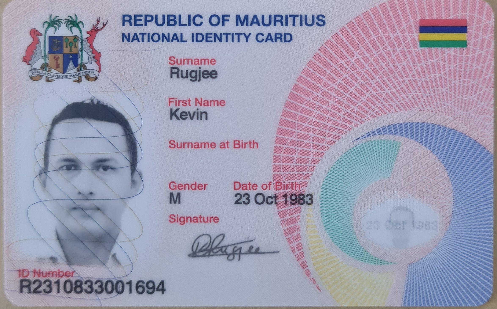
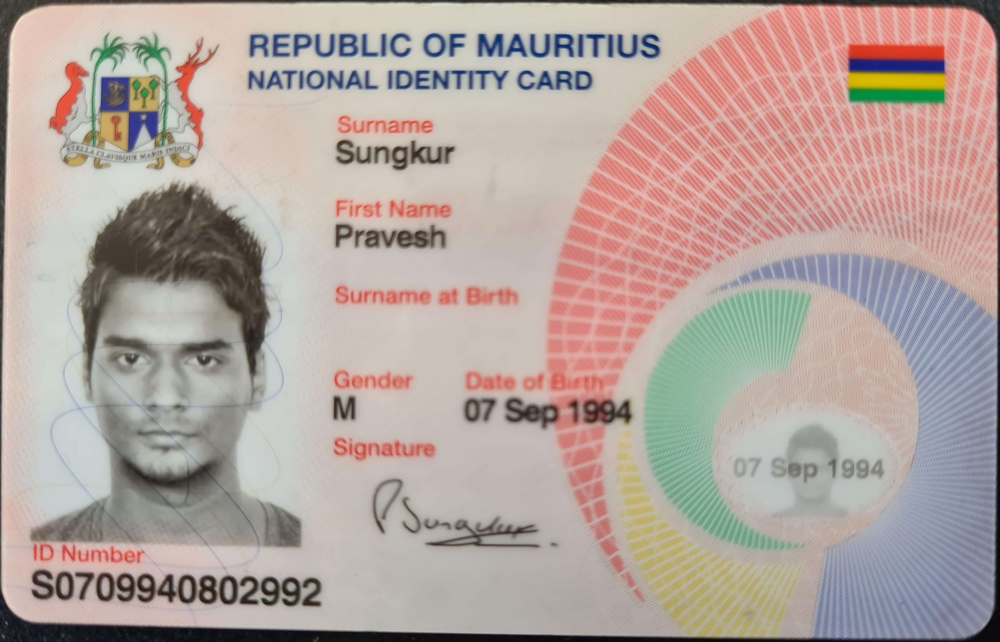
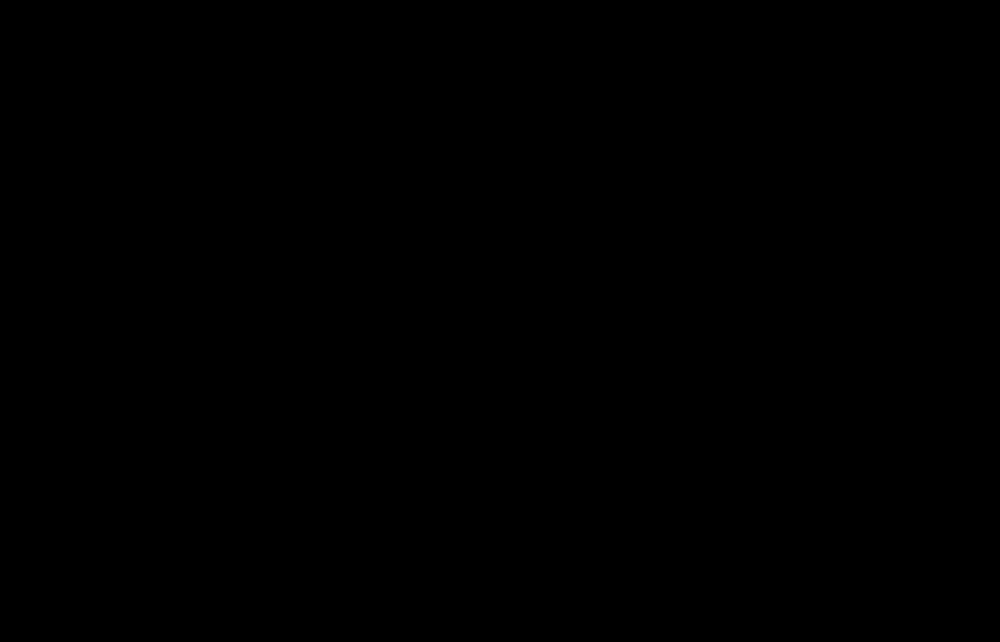
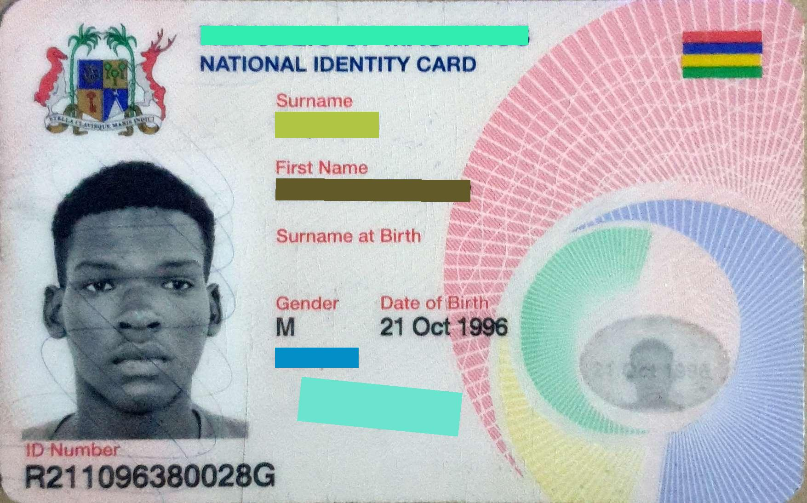
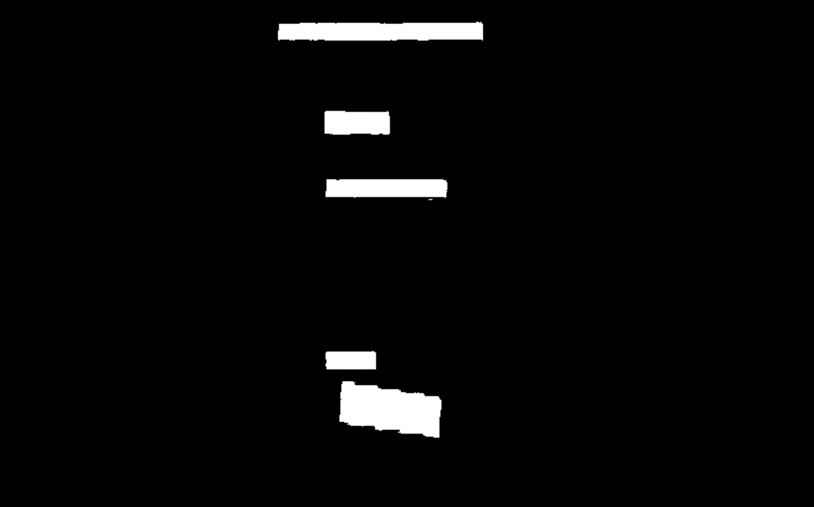
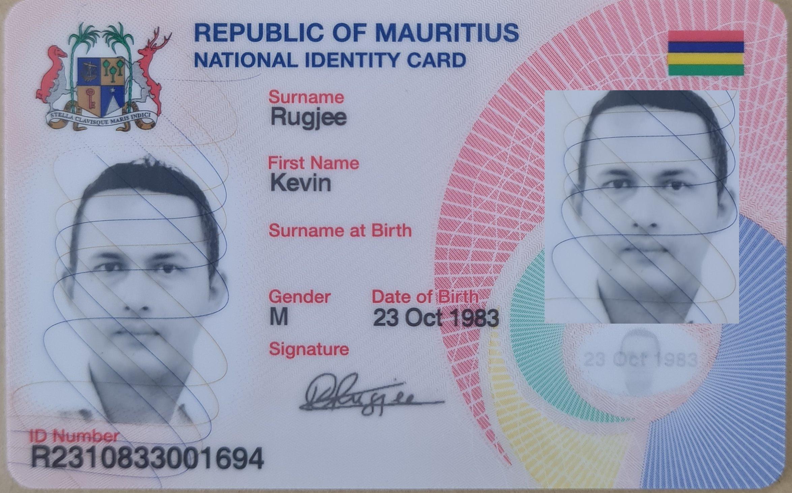
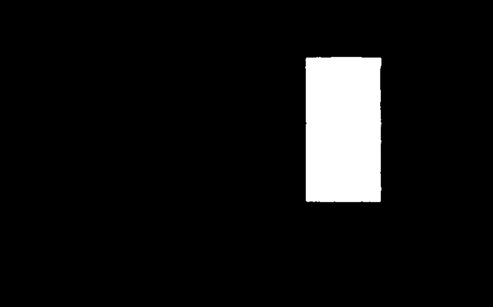
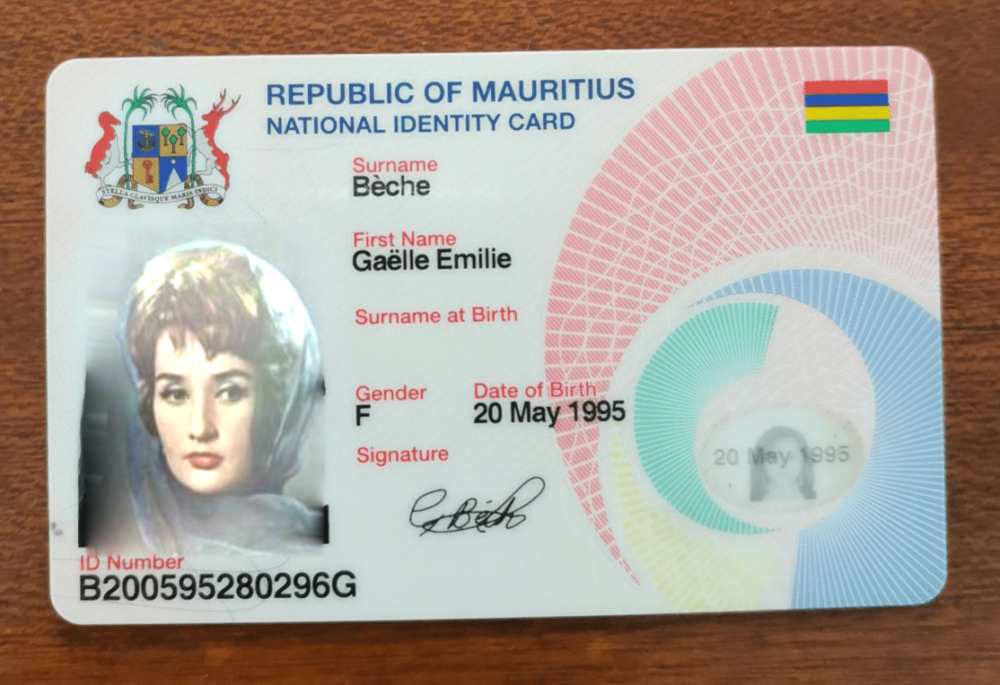
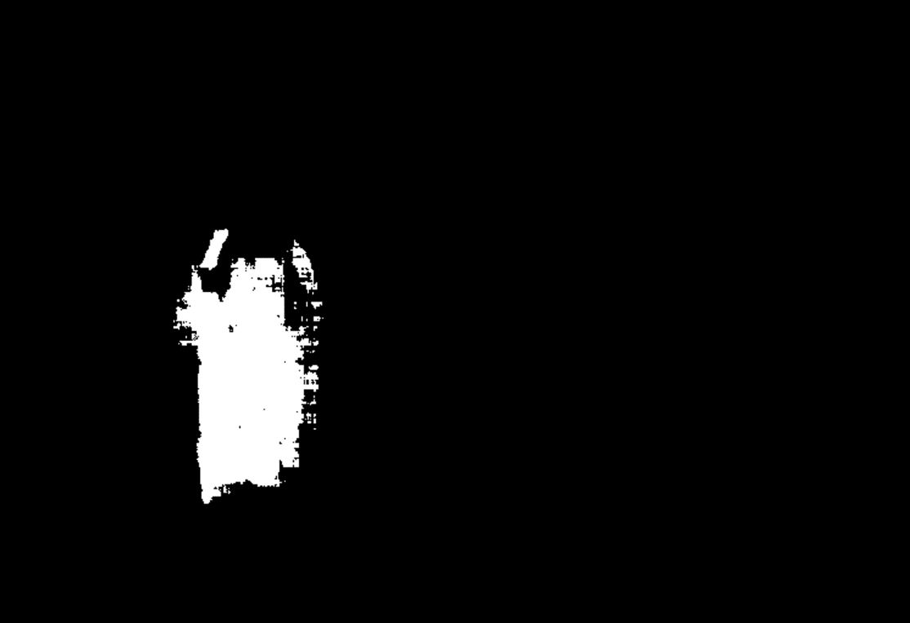

## How the Solution Classifies an Image:
The solution employs a trained model to identify the forgery regions within an image. These regions are illustrated in a mask, with white representing forged pixels and black denoting untouched pixels. The extent of white pixels serves as a basis to categorize an image as original, suspicious, or tampered.

### Steps:
1. **Image Preparation**:
    - The image is loaded, resized to a resolution of 512x512 pixels, and all pixel values are normalized to a range of 0 to 1.

2. **Model Prediction**:
    - The trained deep learning model scrutinizes the image and generates a prediction mask in grayscale. This mask accentuates areas where tampering or forgery is presumed to have taken place.
   - A "mask" in this context is an image of identical dimensions to the input, but instead of displaying the actual content, it unveils the regions (if any) identified as tampered.

3. **Mask Processing**:
    - To render decisions based on the mask, certain thresholds are applied to transition the grayscale mask to a monochromatic format (black and white). Pixel values below 128 are converted to 0 (indicating black), and pixel values above 128 are converted to 255 (indicating white).

4. **Forgery Extent Calculation**:
    - The proportion of the mask that is white (symbolic of forgery) is computed.

5. **Image Classification**:
    - **Original**: Classified if nearly no white pixels are present.
    - **Suspicious**: The image might encompass some regions of forgery, but it's not definitive. If the white pixel percentage ranges between 0 to 0.57%, it will be labeled as suspicious.
    - **Tampered**: Classified if the percentage of white pixels surpasses the upper threshold, i.e., if white pixels percentage is more than 0.57%.

> Note: The thresholds for "Suspicious" and "Tampered" classifications can be adjusted as needed. These thresholds have been established based on the model's performance on Mauritius ID and Pancard images.

### Example images and predicted forgery mask:

|  #  |    Image  | Predicted Mask | Label |
|:---:|:---------:|:--------------:|:-----:|
| 1| { width="300" } | { width="300" } | Original Image |
| 2|  |  | Original Image |
| 3|  |  | Tampered Image (Masking - text redaction) |
| 4|  |  | Tampered Image (Copy-move)|
| 5|  |  | Tampered Image (Splicing - face region changed) |
