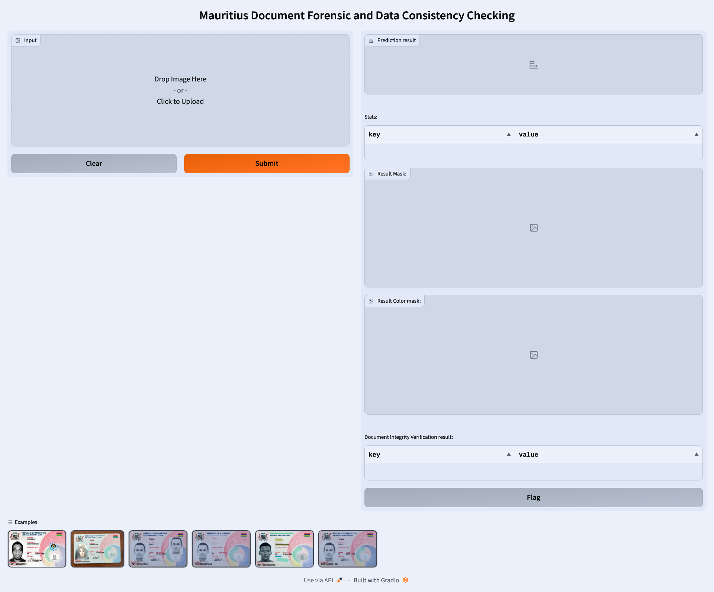

# User Guide

This user guide provides detailed instructions on how to use the Document Forensic Project solution to analyze digital documents for potential tampering. The solution offers two interfaces for user access: Gradio UI and API interface.

- [User Guide](#user-guide)
  - [Access via Gradio UI](#access-via-gradio-ui)
  - [Access via API Interface](#access-via-api-interface)

## Access via Gradio UI

The Gradio UI provides a user-friendly interface to upload and analyze digital documents.

1. **Uploading Documents**:
    - Navigate to the Gradio UI.
    - You can either drag and drop the document file onto the designated area or click to browse and select the file from your device.

2. **Submitting Documents for Analysis**:
      - Once the document file is selected, click on the `Submit` button to initiate the analysis.

3. **Viewing Analysis Results**:
      - **Prediction Result**: Label indicating the document's status as either `Original`, `Suspicious`, or `Tampered`.
      - **Stats**: A key-value pair format displaying statistics of the predicted mask.
      - **Result Mask**: A black and white monochrome mask generated from the grayscale predicted mask. White regions highlight the tampered or altered areas, while black regions signify untouched or genuine areas.
      - **Result Color Mask**: An RGB color mask providing a colored representation of the analyzed areas.
      - **Document Integrity Verification Result**: Key-value pairs indicating detected objects, along with their confidence levels.

## Access via API Interface

The API interface provides a programmatic way to submit documents for analysis and retrieve the results.

1. **API Endpoint**:
    - The API endpoint for document submission is `http://localhost:6003/analyze`.

2. **Submitting Documents for Analysis**:
    - Make a POST request to the API endpoint with the document file attached in the request body.

3. **Viewing Analysis Results**:
    - The analysis results will be returned in the response body, including Prediction Result, Stats, Result Mask, Result Color Mask, and Document Integrity Verification Result, similar to the Gradio UI.

For more information on the API parameters and response format, refer to the API documentation.
